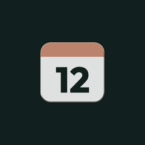
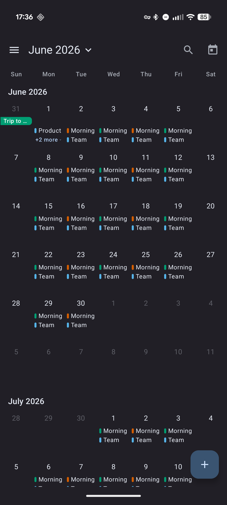
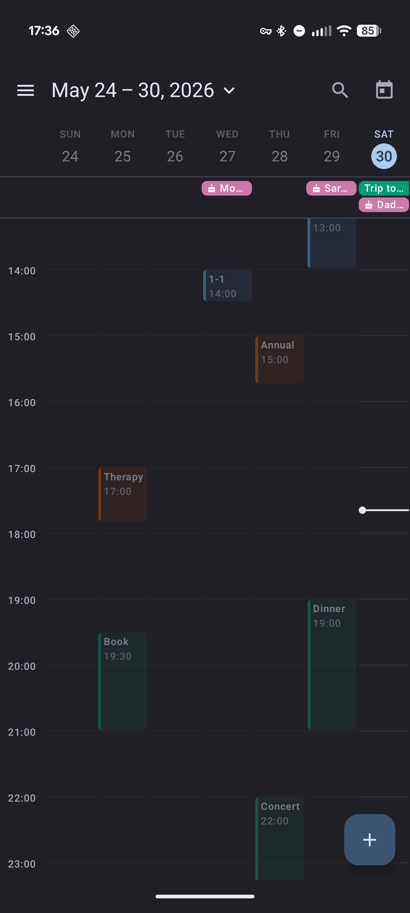
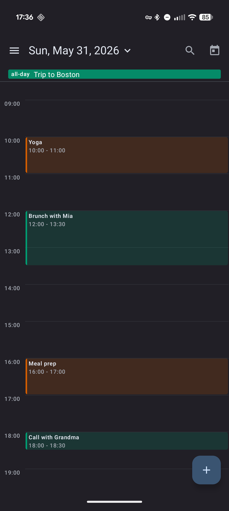
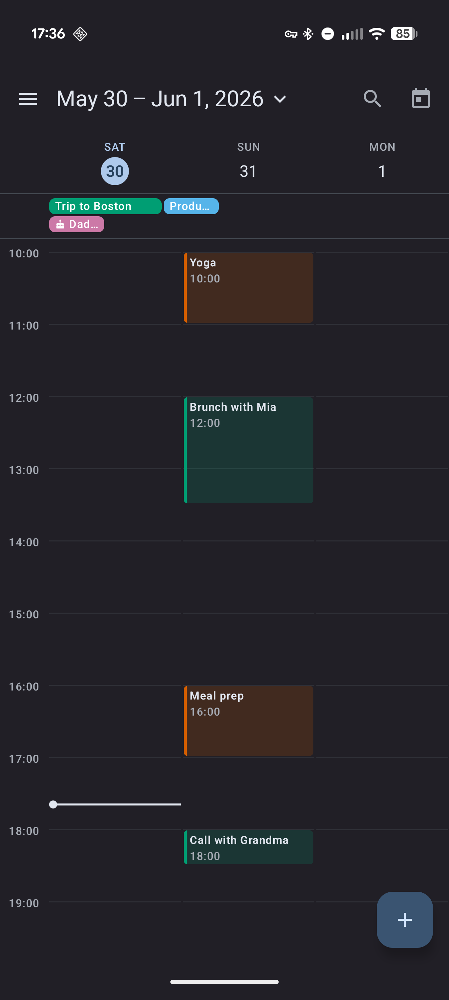
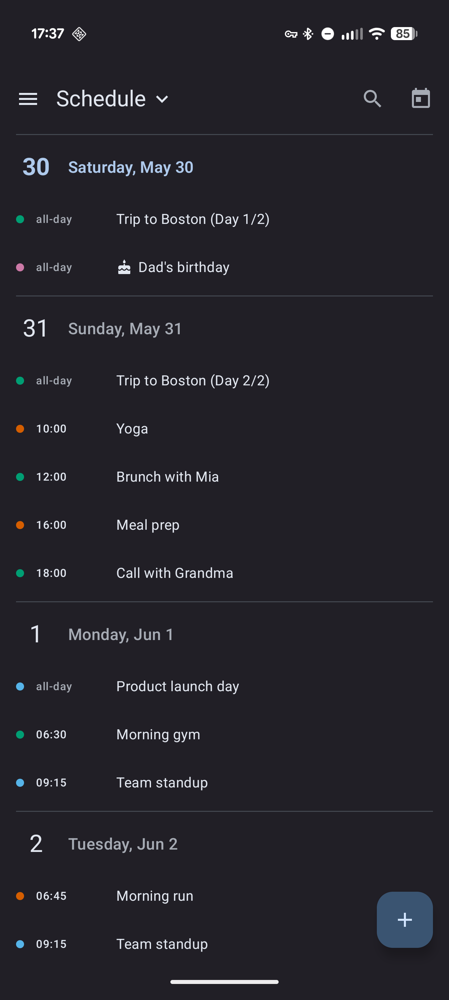
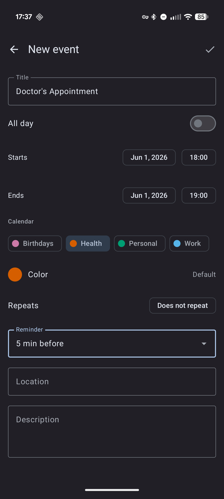
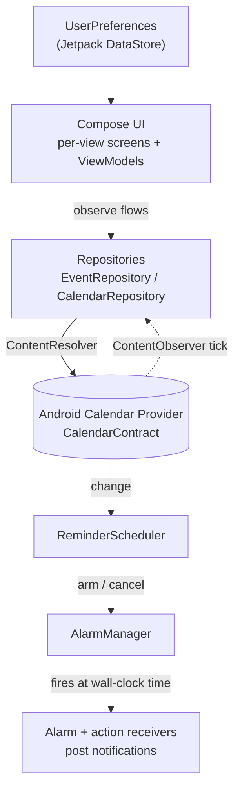

# Asala Calendar

<p align="center">
  
</p>

<p align="center">
A private, offline-first calendar for Android, dressed in Material 3.
</p>

<p align="center">
  <sub><em>Asala</em>: Qunari for &ldquo;soul.&rdquo;</sub>
</p>

<p align="center">
  <a href="https://github.com/Arishawke/asala-calendar/actions/workflows/ci.yml"></a>
  <a href="https://github.com/Arishawke/asala-calendar/releases"></a>
  <a href="LICENSE"></a>
  <a href="docs/ROADMAP.md"></a>
</p>

> [!WARNING]
> **Personal project, heavy AI assistance.** Asala is a hobby Android app built with substantial AI assistance. It is not production software. Use at your own discretion.

Asala keeps no database of its own. Every event lives in the Android Calendar Provider, so what you see here is exactly what every other calendar app on the device sees. It ships with no internet permission at all: your data stays on the phone unless a sync account you set up sends it somewhere.

## Screenshots

<div align="center">
<table>
  <tr>
    <td align="center"><br><sub>Month</sub></td>
    <td align="center"><br><sub>Week</sub></td>
    <td align="center"><br><sub>Day</sub></td>
  </tr>
  <tr>
    <td align="center"><br><sub>3-Day</sub></td>
    <td align="center"><br><sub>Schedule</sub></td>
    <td align="center"><br><sub>Event editor</sub></td>
  </tr>
</table>
</div>

## Features

### What sets it apart

- **Private and offline.** No telemetry, no trackers, no account to create. Your events never leave the device unless you set up a sync account yourself.
- **Continuous or paged month.** Read months as one endless vertical scroll, or swipe a page at a time. 
- **Search everything.** Find any event by title, location, or notes, across every calendar and any date, past or future.
- **All your calendars in one app.** Work, personal, local, and CalDAV (through the DAVx5 companion app), each event colored by the calendar it came from.
- **Six views.** Year, Month, Week, 3-Day, Day, and Schedule.
- **Drag to reschedule.** Pick up an event in Day or Week and drop it on a new time.

### Everything you'd expect

- Create, edit, duplicate, and delete events, including all-day and repeating ones. 
- Reminders before events start, with snooze and separate defaults for timed and all-day events.
- Per-event colors from a preset palette or a custom hex.
- Material 3 throughout, with dynamic color on Android 12+ and Light, Dark, and AMOLED themes.
- A mini-month split view in Week, 3-Day, Day, and Schedule: tap the header to peek a month with event dots and jump to any day.
- A focus mode that dims non-working hours and days.
- Follows your phone: the 24-hour setting, your device language for dates and month names, and optional ISO week numbers.
- A tidy drawer to toggle calendars, hide whole accounts, recolor anything, and rename or delete local calendars.

## Install

Asala ships through GitHub Releases, with a Google Play release in preparation.

- **Direct APK.** Download the latest `asala-calendar-<version>.apk` from [Releases](https://github.com/Arishawke/asala-calendar/releases) and install it. Builds are signed.
- **Auto-update via Obtainium.** Point [Obtainium](https://github.com/ImranR98/Obtainium) at this repository and it notifies you when a new version ships.
- **No in-app updater.** Asala never checks for or downloads updates itself. Updates arrive through your install source (GitHub via Obtainium, or Google Play once published), which is what keeps the app free of any internet or install permission.

## Build from source

Requires JDK 17 and the Android SDK (`platforms;android-36`, `build-tools;36.1.0`, `platform-tools`) with `ANDROID_HOME` (or `ANDROID_SDK_ROOT`) set.

```bash
./gradlew assembleDebug      # build a debug APK
./gradlew testDebugUnitTest  # run the unit tests
```

`minSdk` 28, target and compile SDK 36. The first build fetches Gradle 9.3.1 via the wrapper. The unit tests under `app/src/test/` guard the trickiest pieces: DST transitions, RRULE exception math, and the continuous-Month index mapping.

## Tech

Kotlin and Jetpack Compose on Material 3, reading and writing the Android Calendar Provider (`CalendarContract`) directly. Month and Week grids use [kizitonwose/Calendar](https://github.com/kizitonwose/Calendar); settings persist via Jetpack DataStore. Release builds run through R8 with minify and resource shrink, landing the APK around 3.5 MB.

## Roadmap and architecture

A single Gradle module. The Compose UI reads and writes the system Calendar Provider through two repositories; reminders are armed out of process via `AlarmManager`, so they fire even when the app is closed.



For a file-by-file tour, see [docs/CODE_TOUR.md](docs/CODE_TOUR.md).

- [docs/ROADMAP.md](docs/ROADMAP.md): where Asala is headed.
- [docs/adr/](docs/adr/): architecture decisions, including why the data layer is `CalendarContract` and the conventions for writing to the Calendar Provider.

## Contributing

Solo hobby project, but the build and code conventions are documented for future contributors. See [CONTRIBUTING.md](CONTRIBUTING.md) and [SECURITY.md](SECURITY.md).

## License

[GPL v3](LICENSE). © 2026 Arishawke.
