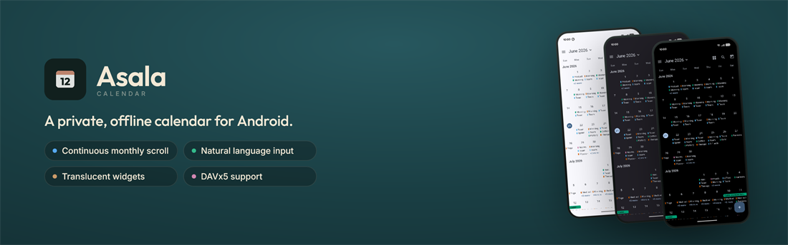
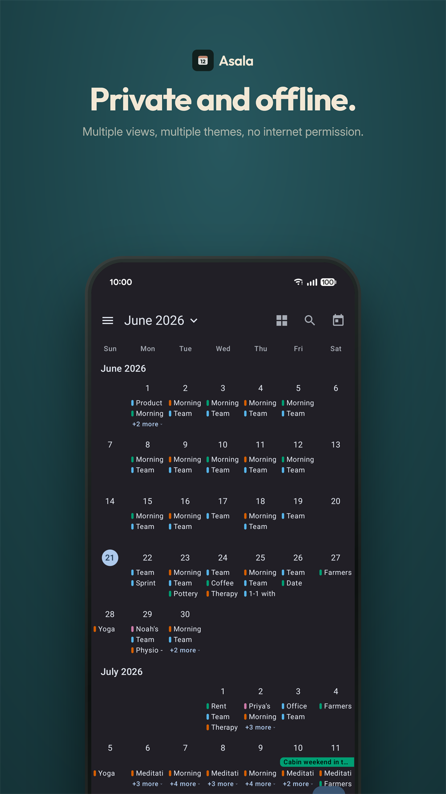
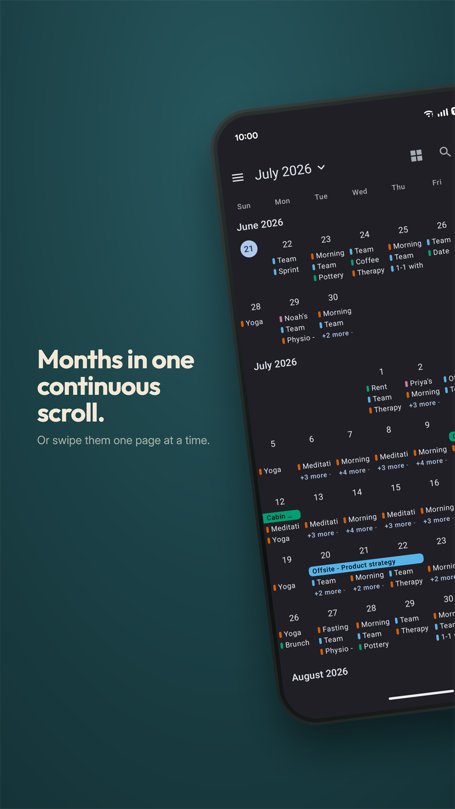
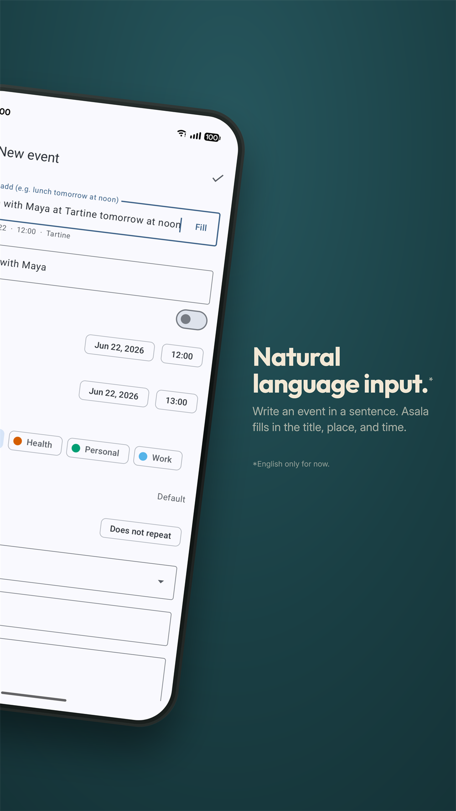
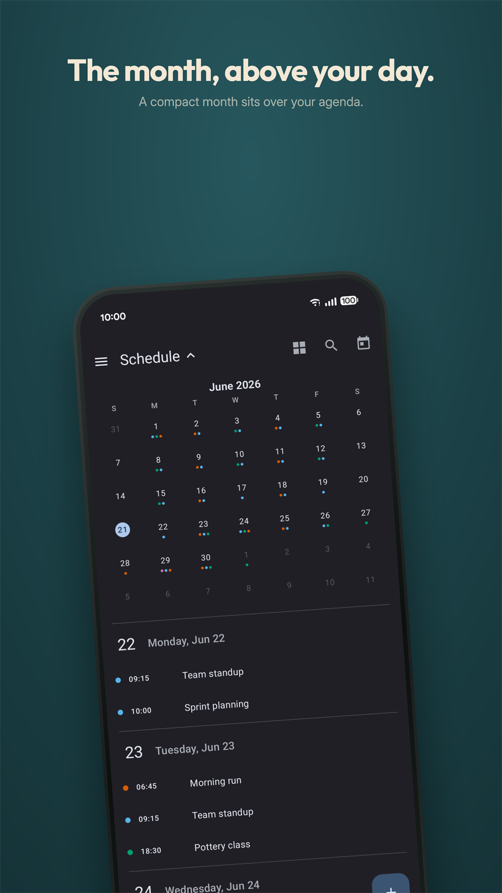
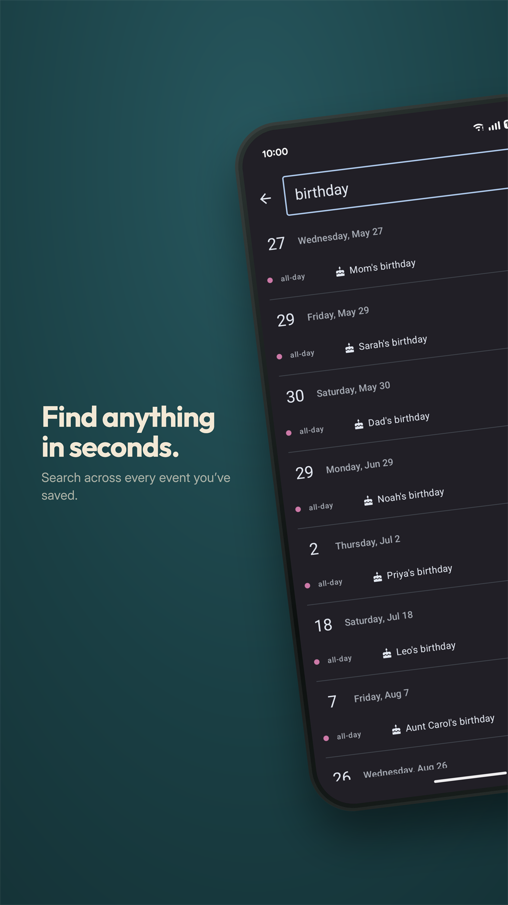
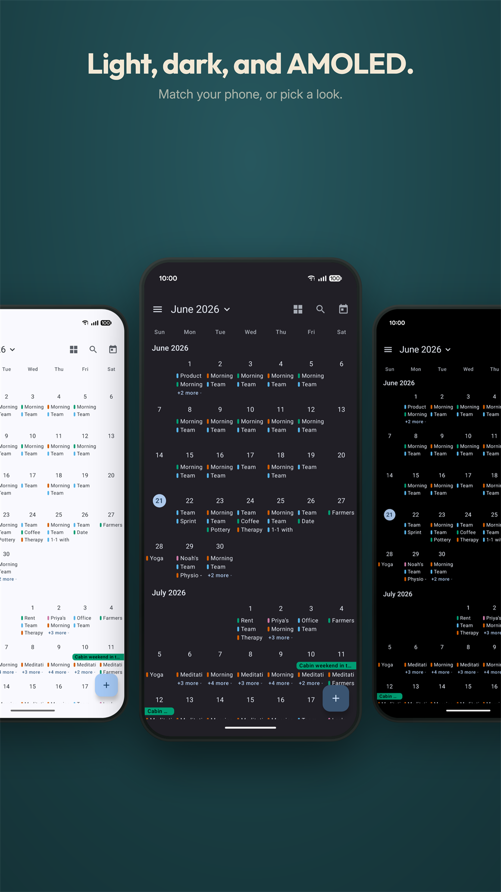

# Asala Calendar

  

A private, offline-first calendar for Android, dressed in Material 3.

  <em>Asala</em>: Qunari for &ldquo;soul.&rdquo;

  
  

  
  

> [!WARNING]
> **Personal project, heavy AI assistance.** Asala is a hobby Android app built with substantial AI assistance. It is not production software. Use at your own discretion.

Asala keeps no calendar data of its own. Your events live in your phone's system calendar, shared with every other calendar app on the device, so nothing is locked inside Asala. And it ships with no internet permission at all: your events stay on your phone unless a sync account you set up sends them somewhere.

## Screenshots

<table>
  <tr>
    <td></td>
    <td></td>
    <td></td>
  </tr>
  <tr>
    <td></td>
    <td></td>
    <td></td>
  </tr>
</table>

## Features

### What sets it apart

- **Private and offline.** No telemetry, no trackers, no account to create. Your events never leave the device unless you set up a sync account yourself.
- **Type events in plain words.** Write "lunch at Cafe Rio tomorrow at noon" in the new-event field and the title, location, date, and time fill in for you to review before saving.
- **Continuous or paged month.** Read months as one endless vertical scroll, or swipe a page at a time.
- **Search everything.** Find any event by title, location, or notes, across every calendar and any date, past or future.
- **All your calendars in one app.** Work, personal, local, and CalDAV (through the DAVx5 companion app), each event colored by the calendar it came from.
- **Six views.** Year, Month, Week, 3-Day, Day, and Schedule.
- **Drag to reschedule.** Pick up an event in Day or Week and drop it on a new time.

### The usuals

- Create, edit, duplicate, and delete events, including all-day and repeating ones.
- Reminders before events start, with snooze and separate defaults for timed and all-day events.
- Per-event colors from a preset palette or a custom hex.
- Material 3 throughout, with dynamic color on Android 12+ and Light, Dark, and AMOLED themes.
- A mini-month split view in Week, 3-Day, Day, and Schedule: tap the header to peek a month with event dots and jump to any day.
- A focus mode that dims non-working hours and days.
- Follows your phone: the 24-hour setting, your device language for dates and month names, and optional ISO week numbers.
- A tidy drawer to toggle calendars, hide whole accounts, recolor anything, and rename or delete local calendars.

## Install

Asala is on Google Play, and also ships through GitHub Releases.

- **Google Play.** Install from [Google Play](https://play.google.com/store/apps/details?id=com.arishawke.asala.calendar); updates arrive automatically.
- **Direct APK.** Download the latest `asala-calendar-<version>.apk` from [Releases](https://github.com/Arishawke/asala-calendar/releases) and install it. Builds are signed.
- **Auto-update via Obtainium.** Tap the Obtainium button at the top of this page, or point [Obtainium](https://github.com/ImranR98/Obtainium) at this repository, and it notifies you when a new version ships.
- **No in-app updater.** Asala never checks for or downloads updates itself. Updates arrive through your install source (Google Play, or GitHub via Obtainium), which is what keeps the app free of any internet or install permission.

## License

[GPL v3](LICENSE). © 2026 Arishawke.
